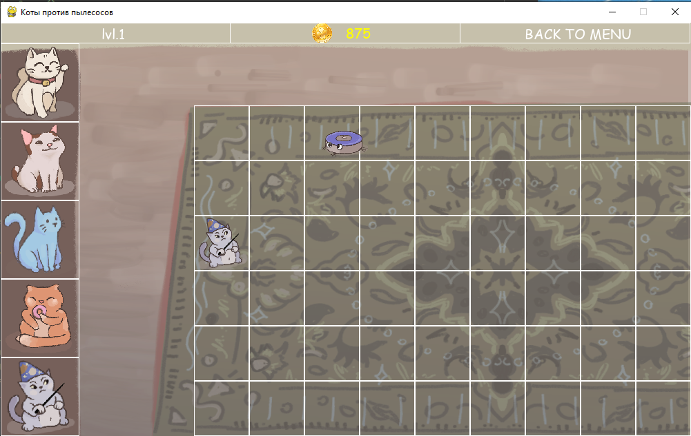

### Название проекта: 
Игра: "Котики против пылесосов"

### Авторы:
Жильцова София и Полякова Юлия

### Идея:
Весёлая игра, прототипом которой является "Зомби против растений"

### Реализация:
Проект состоит из шести классов и нескольких функций.

Классы:

1. **Board** - основной класс для рисования клетчатого поля. В конструктор передается ширина и высота поля в клетках.

    Реализованные методы:

    **set_view(self, left, top, cell_size)** - меняет размеры и расположение поля.

    **render(self, surface)** - отрисовка поля.

    **get_click(self, mouse_pos)** - возвращает координаты клетки (номер столбца, номер строки)

    **on_click(self, cell_coords)** - возвращает координаты клетки.

    **get_cell(self, mouse_pos)** - преобразует координаты в номер столбца и строки.

    **change_board(self, pos)** - изменяет статус клетки.

    **ret_status(self, pos)** - возвращает статус клетки.

2. **Shop(Board)** - класс отрисовки магазина с котиками. Он отличается от обычного клетчатого поля, методом отрисовки;
также здесь реализованы методы для работы с изображениями котиков.

    Реализованные методы:

    **render(self, surface)** - отрисовка котиков в магазине

    **check_cat(self, pos)** - проверяет, можем ли мы купить нажатого кота и возвращает его название и стоимость.

    **move_cat_to_board(self, pos, name, cost)** - передвижение кота на доску

3. **InfoBar(Board)** - класс для информационной панели. У неё три ячейки. Имя уровня, количество денег, возврат в меню уровней.

    Реализованные методы:

    **render(self, surface)** - для отрисовки прямоугольников

    **get_cell(self, mouse_pos)** - получение координаты клетки

    **update(self)** - обновление надписи уровня, денег, отрисовка текста на панели

4. **Cats(pygame.sprite.Sprite)** - класс котиков. Здесь реализована анимация, обновление и атака котиков. В конструкторе
берутся данные о котиках из БД.

    Реализованные методы:

    **update(self, dt)** - отрисовка анимации и атаки котов

    **taking_damage(self, damage)** - получение урона.

    **death(self)** - смерть котика.

    **cut_sheet(self, sheet, columns, rows)** - обрезка фрейма

5. **CatAttack(pygame.sprite.Sprite)** - класс атаки котов.

    Реализованные методы:

    **update(self, dt)** - пересечение спрайтов атаки с врагом, если пылесос убит, то прибавляются деньги.

    **attack(self, en)** - атака кота.

6. **Enemies(pygame.sprite.Sprite)** - класс врагов. В конструкторе также из Бд беруться данные о врагах.

    Реализованные методы:

    **update(self, dt)** - отрисовка анимации врага, проверка его атаки.

    **attack(self, cat)** - атака по коту.

    **taking_damage(self, damage)** - отнимается здоровье у врага.

    **death(self)** - смерть врага.

    **cut_sheet(self, sheet, columns, rows)** - обрезка картинки для анимации кота.

Функции:

* **terminate()** - выход из игры.
* **load_image(name, colorkey=None)** - загрузка изображений.
* **draw_text(text, color, type)** - рисование текста для заставки игры.
* **start_screen()** - рисование экрана начала игры. Есть две кнопки: начать игру и выйти из игры. При наведении на текст,
его цвет меняется.
* **level_map()** - при нажатии на "Начать игру" рисуется карта уровней. При нажатии на изображение уровня с цифрой, открывается 
определенный уровень из базы данных. В зависимости от состояния уровня в БД (пройден, не пройден), рисуется либо красная,
либо зеленая картинка. Отслеживается нажатие мышкой на уровень, и с помощью скрытого клетчатого поля проверяется нажатие 
на определенный уровень и можно получить цифру этого уровня. Возвращает текст уровня ввиде строки с символами из БД.
* **load_level(text)** - загружает уровень по тексту. Точки - секунды ожидания врагов. Враги обозначаются разными буквами.
* **change_coins(num)** - обновляет поле с монетами в БД.
* **text_for_win_window(text, pos)** - добавляет текст в окно завершения уровня.

Также организована особая система перехода из уровня обратно в меню уровней. Есть основной цикл, который в зависимости от 
состояния (от переменной gamer) по разному запускает игровой цикл, который находится в основном цикле.

### Описание БД game_base.sqlite3:
В БД 4 таблицы.
1. cats: id, name, hp, atack_image, dmg, atack_speed, fly_atack_speed, cost
2. enemies: id, name, hp, dmg, speed, atack_speed
3. levels: id, name, lvl_map, status
4. now_info: coins

### Скриншоты




### Библиотеки, необходимые для запуска
```
pip install sys
pip install pygame
pip install sqlite3
```

### Запуск проекта
Выполнить **main.py**